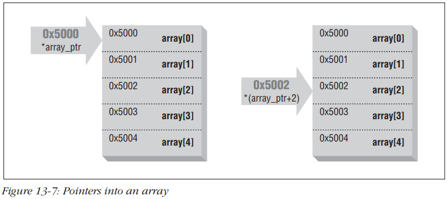

# Punteros

Los datos se almacenan el una dirección de memoria, y esta direccióna a la vez puede ser obtenida y manipulada como un dato tambien.

Entonces un puntero es tambien una **variable** que contiene la **dirección** de otra variable.


`&` direccion de la variable en memoria

`*` acceso al objeto apuntado

``` C
int main() {
    // declarando variables
    int edad = 21;
    int *edadPointer;

    // asignamos el puntero
    edadPointer = &edad;
    *edadPointer = 23;
}
```

>Para todo tipo de datos T existe un tipo de datos que se denomina “Puntero a T” definido como “T *”.

# NULL pointer
stdio.h

la constante NULL es una constante que representa el “puntero vacío”. Su valor numérico es cero, y cuando un puntero tiene este valor no está apuntando a nada.

``` C
int *ptr,
ptr1 = NULL;
```
# Functions

pasando un puntero en un funcion

``` C
#include <stdio.h>
void inc_count(int *count_ptr)
{
    (*count_ptr)++;
}

int main()
{
    int count = 0; /* number of times through */
    while (count < 10) {
        inc_count(&count);
        printf("%d\n", count);
    }
    
    return (0);
}
```

## Punteros y struct 

``` C	
struct s 
{
    int x;
    char c;
};

int main () {
    struct s element;
    struct s *pointer;
    pointer = &element;
}
```

¿Como acceder a los datos de un struct pointer?
existen dos formas la forma indirecta
``` C
(*pointer).x = 10;
(*pointer).c = 'l';
```

pero esto es equivalente a esta segunda forma
``` C
pointer->x = 10;
pointer->c = 'l';
```


## Punteros y arrays o vectores

podemos hacer calculos aritmeticos con los punteros. Entonces definimos un puntero de un array de caracteres:

``` C
// apuntando al primer caracter
char *array_ptr = "esto funciona";

// con un paso extra
char array[] = "lo que conociamos";
char *array_ptr2;
array_ptr2 = &array[0];
// es igual a array_ptr2 = array;
```

entonces diriamos que:


